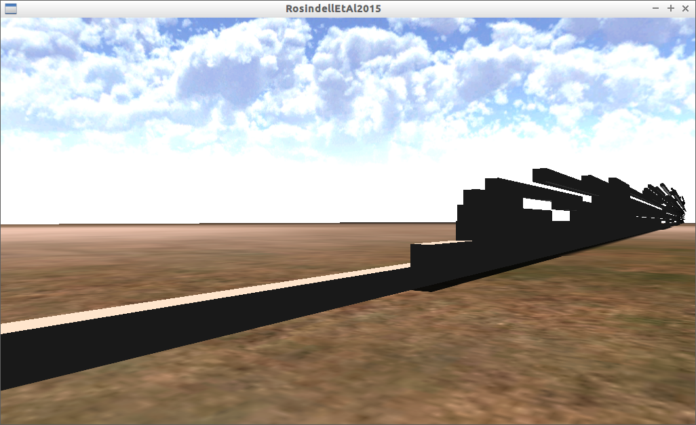
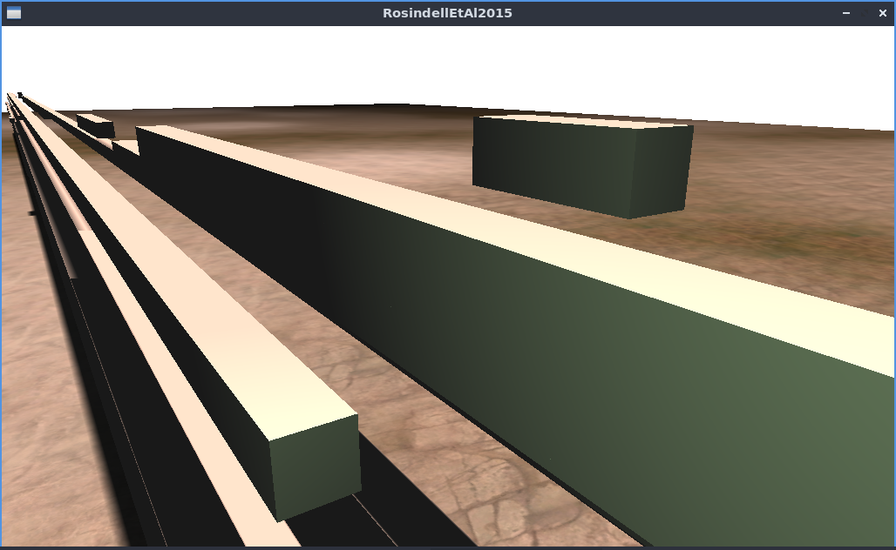
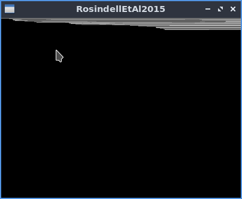

# RosindellEtAl2015

Branch |[](https://travis-ci.org)|[](https://www.codecov.io)
-------|---|---
master |[](https://travis-ci.org/richelbilderbeek/RosindellEtAl2015)|[](https://codecov.io/github/richelbilderbeek/RosindellEtAl2015/branch/master)
develop|[](https://travis-ci.org/richelbilderbeek/RosindellEtAl2015)|[](https://codecov.io/github/richelbilderbeek/RosindellEtAl2015/branch/develop)






Code for this article:

```
Rosindell, James, Luke J. Harmon, and Rampal S. Etienne.
"Unifying ecology and macroevolution with individual‐based theory." 
Ecology letters 18.5 (2015): 472-482.
```

The original code (v.1.2) can be found in the folder `Original` and is programmed by James Rosindell.

The refactored code (refactored by Richel Bilderbeek) can be found in the folder `Refactored`. This code can be compiled with Qt Creator.

All code has been tested to compile and run successfully on Linux.

## Console version

Both folders `Original` and `Refactored` contain an (identically working) console version.

The `.cpp` file in `Original` can be compiled manually.

The console version in `Refactored` can be compiled by opening the 
Qt Creator project file `RosindellEtAl2015Console.pro` in e.g. Qt Creator.

## Desktop version

The desktop version in `Refactored` can be compiled by opening the 
Qt Creator project file `RosindellEtAl2015Desktop.pro` in e.g. Qt Creator.

## 3D version

The 3D version uses the library [Urho3D](https://github.com/urho3d/Urho3D).

To build Urho3D, run the script `Refactored/Urho3D.sh`. Notice the errors, you might
have some packages that need to be installed.

The 3D version in `Refactored` can be compiled by opening the 
Qt Creator project file `RosindellEtAl2015Desktop3d.pro` in e.g. Qt Creator.

If you get the error message `Not found: Urho3D/lib/libUrho3D.a` you did not successfully build Urho3D.
Run the script `Refactored/Urho3D.sh` again and check the errors: you will have some packages 
that need to be installed.


Shown here are the competitive traits in time. Time goes from left to right. 
Initialially, all lineages have the same competitive trait value. 
Trait values go from front to back.
The number of different traits is stacked.

## I have a question/feature request/bug

These can be submitted in 'Issues'.

## I want to contribute

You can be assigned an Issue, if you posted one. Also Pull Requests are fine.

Note: the code in `Original` will be kept as the golden standard. Any modifications to `Original` are rejected, use
`Refactored` instead.

## Other screenshots



